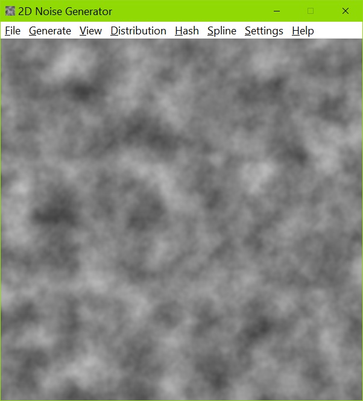

# Smooth 2D Noise Viewer

The source code for this 2D noise generator and viewer, written and maintained by
[Ian Parberry](http://ianparberry.com), is intended to be used by students to
extend and modify while they are learning about Perlin noise. See 
[https://ian-parberry.github.io/smooth2dnoiseviewer/](https://ian-parberry.github.io/smooth2dnoiseviewer/)
for code documentation.

## Requirements

Windows 10 and Visual C++.
This code has been tested with Visual Studio 2019 Community under Windows 10.

## License

This project is released under the
[MIT License](https://github.com/Ian-Parberry/wangtiler/blob/master/LICENSE).